<div align="center">

# 🔐 CYBERSECURITY & PENETRATION-TESTING LAB SETUP

### An isolated, virtual penetration testing environment built on Oracle VirtualBox. This project establishes an offensive testing node alongside enterprise Windows and Android target endpoints, networked across a private subnet (`10.0.0.0/24`) for security auditing, network analysis, and exploit testing.

---

</div>

# 📌 PROJECT OVERVIEW

This project is a private cybersecurity testing lab built on Oracle VirtualBox. It includes an attacker machine (Kali Linux) and two target machines (Windows 10 and Android-x86). All machines run on an isolated private network so testing is safe and does not touch the host computer or the home Wi-Fi
---

# 🎯 OBJECTIVES

The main objectives of this project are to:
Install and configure Oracle VirtualBox on the host machine.  
Create an isolated NAT Network (10.0.0.0/24) with internet access. 
Install and import Kali Linux as the dedicated attacker machine.  
Install Windows 10 and Android-x86 as practice target machines.  
Assign consistent, static IP addresses to all virtual machines (Kali: 10.0.0.2, Windows: 10.0.0.10, Android: 10.0.0.9). 
Configure shared folders and bidirectional clipboard integration. 
Resolve storage issues by offloading large virtual disks to an external drive (D:).
Fix display freezes and interface mapping errors on Android-x86.
Verify bidirectional network connectivity and DNS resolution across the lab. 
Take clean VM snapshots of all machines for quick recovery.
Document the complete setup process and troubleshooting steps for the team

---

# 🛡️ PURPOSE OF THE LAB

The lab provides an isolated and controlled environment for cybersecurity learning and authorized security testing.

It can be used for activities such as:
* Network reconnaissance
* Port scanning
* Vulnerability assessment
* Packet analysis
* Web security testing
* Exploitation practice
* Security-tool experimentation

> ⚠️ **Important:** This laboratory must only be used for systems that you own or have explicit permission to test. Do not use the lab or its tools to attack unauthorized systems.

---

# Lab Implementation Phases
This lab is set up in two main phases:Phase 1: The Attacker Machine (Kali Linux)Setting up Kali Linux as the main offensive station. This includes importing the VM, enabling bidirectional clipboard and shared folders, assigning the static IP (10.0.0.2/24), fixing network timeouts, and verifying internet access.

Phase 2: The Target Endpoints (Windows 10 & Android-x86)Setting up the victim machines to practice real-world attacks. This includes installing Windows 10 (10.0.0.10) on an external drive (D:), installing Android-x86 (10.0.0.9), fixing display driver crashes, and confirming all machines can communicate across the network.  

# 🏗️ LAB ARCHITECTURE


Additional target machines can be added to the same virtual network in future projects.

## ⚙️ Lab Configuration

| 🧩 Component       | ⚙️ Configuration   |
| ------------------ | ------------------  |
| 🖥️ Host OS         | Windows 10         |
| 🧠 Host RAM        | 8 GB               |
| ⚡ Processor       | Intel Core i7      |
| 🧰 Hypervisor      | VirtualBox 7.2  |
| 🐉 Security OS     | Kali Linux 2026.2  |
| 🧠 Kali RAM        | 2048 MB            |
| 🌐 Virtual Network | NAT Network        |
| 📡 Network Address | 10.0.0.0/24        |
| 🐧 Kali IP Address | 10.0.0.2/24        |
| 🚪 Default Gateway | 10.0.0.1           |
| 🌍 DNS Server      | 8.8.8.8            |
| 🔮 Future VM Range | 10.0.0.3–10.0.0.99 |

---

# 🪜 Lab Setup Procedure

## Step 1. Install 7-Zip

7-Zip was installed to extract the Kali Linux virtual-machine package, which may be distributed as a `.7z` archive.

**Tool:** 7-Zip

---

## Step 2. Install VirtualBox

VirtualBox was installed as the hypervisor.

---

## Step 3. Create the NAT Network

A dedicated NAT Network was created in VirtualBox.

Configuration:
Network Name: NatNetwork
IPv4 Prefix:  10.0.0.0/24
DHCP:         Enabled
IPv6:         Disabled

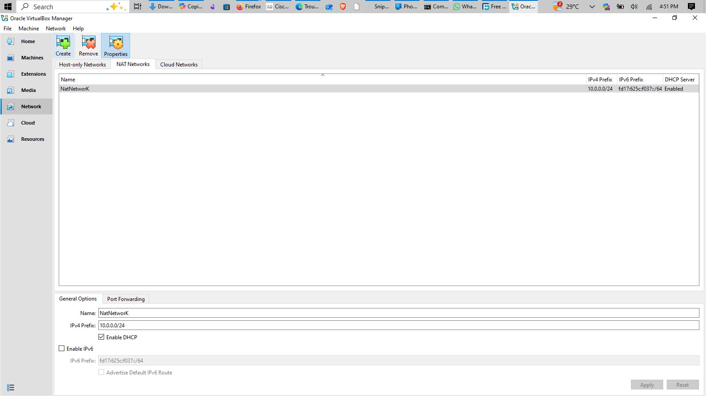

A **NAT Network** was selected because multiple virtual machines connected to the same NAT Network can communicate with one another while also having outbound network connectivity.

This will allow future attacker and target VMs to communicate within the lab.


---

## Step 4. Import Kali Linux

The Kali Linux virtual machine was downloaded from the official Kali Linux website and imported into VirtualBox.

The VM network adapter was configured as follows:

```text
Adapter 1
Attached to: NAT Network
Network:     NatNetwork
Adapter Type: Intel PRO/1000 MT Desktop
```

The VM was allocated:

RAM: 2048 MB

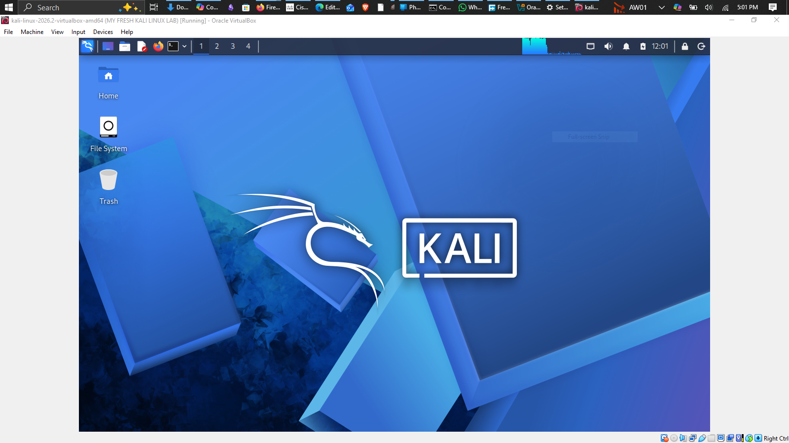

Step 5. Configure the Kali Linux Network
The Kali Linux network configuration was checked and configured with a consistent IPv4 address.

Example configuration:

IP Address: 10.0.0.2

Subnet Mask: 255.255.255.0

Gateway: 10.0.0.1

DNS: 8.8.8.8

A consistent IP address makes it easier to document the lab and reference the Kali machine in future exercises.

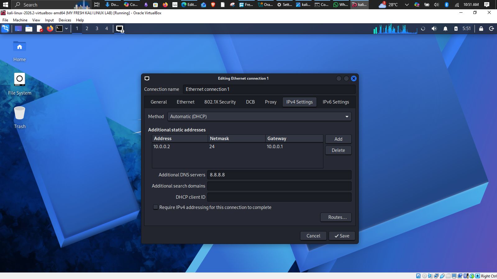


Step 6. Create a Clean VM Snapshot
After completing the initial configuration, a VirtualBox snapshot was created.

Example snapshot name: MY FRESH KALI LINUX LAB

Clean Kali - Network Setup

The snapshot represents the clean baseline of the laboratory. If a future exercise changes or damages the VM configuration, the machine can be restored to this baseline.


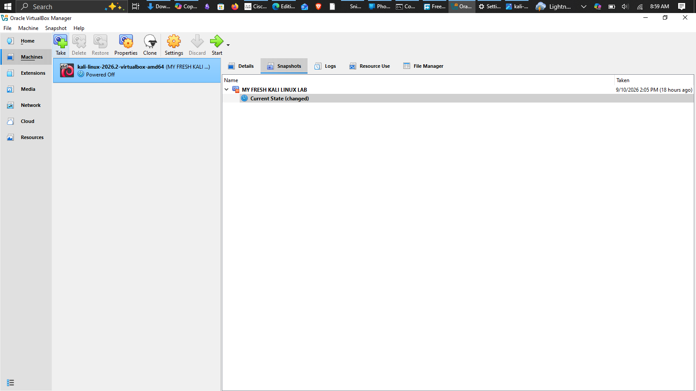

# 🔎 Lab Verification

| ✅ Test                        | 🧾 Command                      | 🎯 Expected Result              |
| ----------------------------- | ------------------------------- | ------------------------------- |
| 🌐 Check IP address           | `ip a`                          | Correct Kali IP displayed       |
| 📡 Test gateway               | `ping 10.0.0.1`                 | Successful replies              |
| 🌍 Test Internet connectivity | `ping 8.8.8.8`                  | Successful replies              |
| 🔎 Test DNS resolution        | `nslookup networkwalks.com`     | Domain resolves                 |
| 🧰 Verify Nmap                | `nmap --version`                | Nmap version displayed          |
| 🔄 Verify snapshot            | Restore snapshot and run `ip a` | Baseline configuration restored |

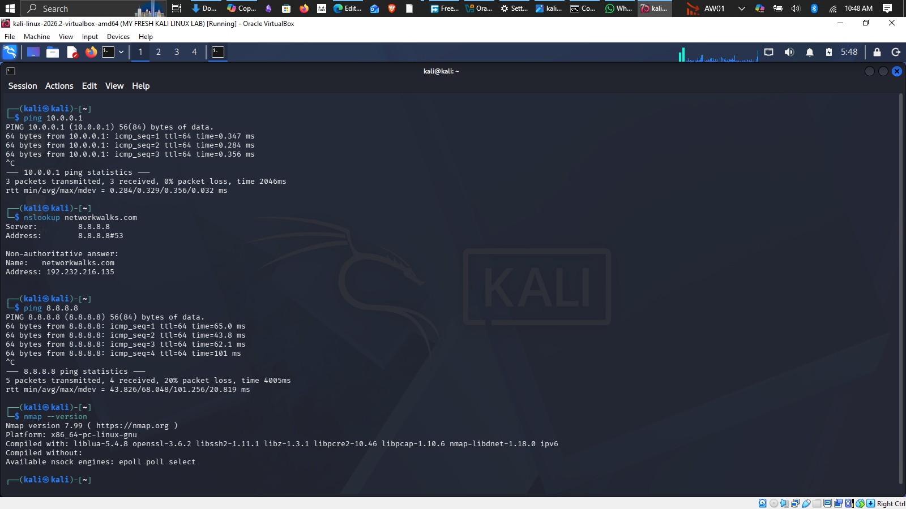

### Example Results

```text
IP Address:
10.0.0.2/24

Gateway:
10.0.0.1

DNS:
8.8.8.8
```

# 💡 What I Learned

Through this project, I learned how to create and configure a virtual environment for cybersecurity practice.

The most important concepts I learned include:

### 1. NAT vs NAT Network

A standard NAT configuration and a NAT Network serve different purposes.

A NAT Network allows multiple VMs connected to the same virtual network to communicate with one another while providing network address translation for external connectivity.

This makes it useful for building a multi-machine cybersecurity laboratory.

### 2. Virtual Machine Networking

I learned how VirtualBox virtual network adapters connect virtual machines to different types of networks and how network configuration affects communication between machines.

### 3. Static IP Configuration

I learned how to configure and verify IPv4 addressing, subnet masks, gateways, and DNS settings in Kali Linux.

### 4. VM Snapshots

I learned that a clean snapshot should be created **before performing risky or experimental activities**.

This provides a known-good recovery point for future cybersecurity exercises.

### 5. Documentation

I learned that documenting commands, configuration, screenshots, problems, and solutions is an important part of a professional cybersecurity project.

---

# 🔐 Security & Ethical Use

This laboratory is intended strictly for education purposes only.

---

# 🔗 Tools & Resources

- **7-Zip:** [https://7-zip.org/download.html](https://7-zip.org/download.html)
- **VirtualBox:** [https://virtualbox.org/wiki/Downloads](https://virtualbox.org/wiki/Downloads)
- **Kali Linux:** [https://kali.org/get-kali](https://kali.org/get-kali)

---


# Phase 2: Target Endpoints SetupPart 1: Windows 10 Enterprise Target Machine (windows10-lab)1. 

### Overview & Purpose; 

Windows 10 is configured as the primary enterprise target endpoint in our cybersecurity lab. It serves as a victim machine for future practice with vulnerability scanning, privilege escalation, and credential testing. 

2. Virtual Machine Hardware & Resource AllocationOperating System: Windows 10 (64-bit, Version 22H2)
3.  Base Memory (RAM): 2048 MB (2 GB)  Processors (vCPU): 2 vCPUsFirmware:
4.  BIOS / DefaultOptical Drive: Detached installer ISO (Win10_22H2_English_x64v1.iso) after installation was complete
5.  Storage Optimization & External Drive MigrationTo prevent filling up the host computer's primary C: drive (which had limited free space), the virtual hard drive was moved to an external high-capacity drive:The virtual hard disk file (windows10-lab.vdi, ~12.8 GB) was moved to: D:\windows10\windows10-lab\windows10-lab.vdi
6.  In VirtualBox Storage Settings, clicked Controller: SATA, selected Add Hard Disk, and chose the .vdi file from the D: drive.  Cleared any old, broken disk references in VirtualBox Virtual Media Manager (Ctrl + D) to avoid duplicate UUID errors.

   
8.  


# Network Configuration

The machine was attached to the isolated lab network so Kali Linux can reach it:
Opened VM Settings > Network > Adapter 1.  
Set Attached to: NAT Network.  
Set Name: NatNetwork.  
Clicked Advanced and set Promiscuous Mode to Allow All so testing tools can see network traffic. 
Verified Cable Connected was checked. 


# IP Addressing & ConfigurationInside

Windows 10, the network adapter was assigned a static IP in the lab (subnet:IP Address: 10.0.0.10  Subnet Mask: 255.255.255.0 (/24)  Default Gateway: 10.0.0.1  Preferred DNS: 8.8.8.8  Alternate DNS: 10.0.0.1 )

### Steps taken inside Windows:

Opened Control Panel > Network and Internet > Network Connections.

Right-clicked the Ethernet adapter and selected Properties.

Selected Internet Protocol Version 4 (TCP/IPv4) and clicked Properties.

Selected Use the following IP address and entered the values above.

Clicked OK to save.


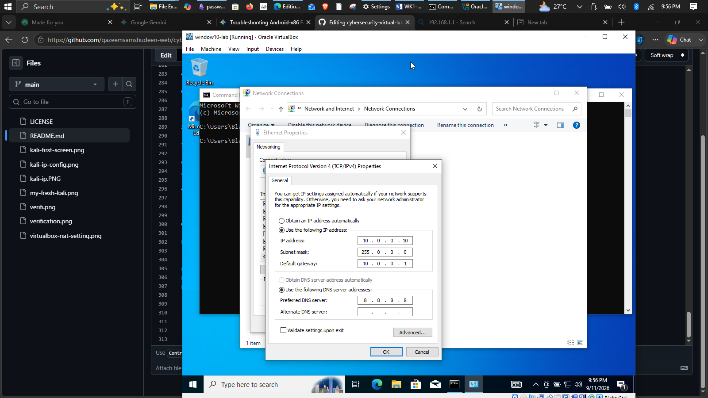

### Verification & Testing

To confirm the Windows network configuration:

Opened Command Prompt (cmd) inside Windows.

Ran the command:

ipconfig
ping 8.8.8.8

ping 10.0.0.1

ping networkwalks.com


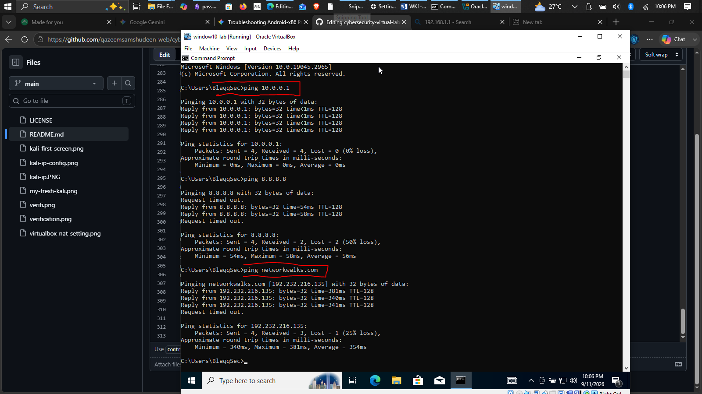

 Clean State Snapshot Before running any tests or scans on Windows
 Took a clean snapshot named my-window10-lab.  This lets us restore Windows to a clean, working state at any time with one click. 

 
 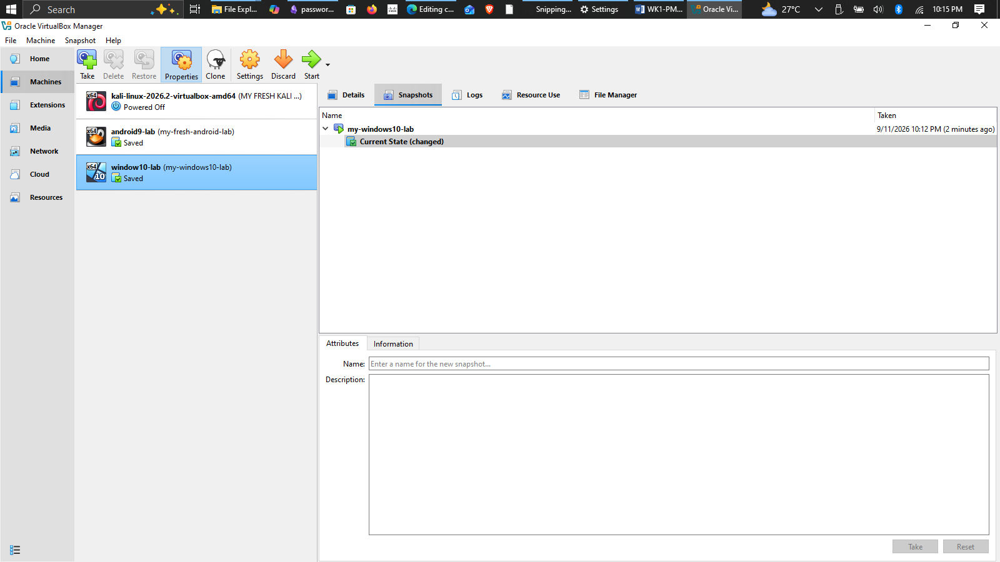
 

# Part 2: Android-x86 Mobile Target Machine (android9-lab)

 1. Overview & PurposeAndroid-x86 is deployed as the mobile endpoint target in our cybersecurity lab.
 2. It allows us to simulate mobile attacks, test Android Debug Bridge (ADB) exploitation, and audit mobile application security in an isolated environment.
 3. Android-x86 9.0-r2 (64-bit)  Base Memory (RAM): 1536 MB (or 2048 MB)Processors (vCPU): 1 vCPUGraphics Controller: Changed to VBoxVGA.  Video Memory: Set to 128 MB  Enable 3D Acceleration : checked

    
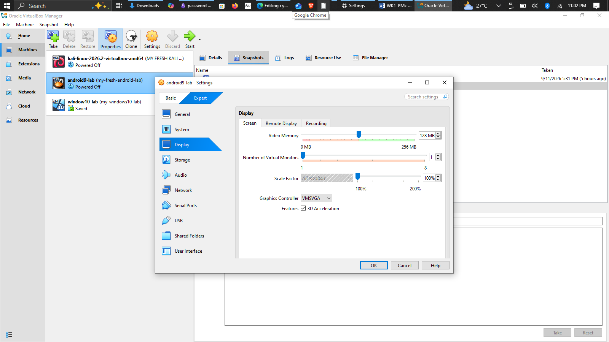

### Hypervisor Network Settings 
 Opened VM Settings > Network > Adapter 1. 
 Set Attached to: NAT Network.  
 Set Name: NatNetwork.  
 Set Promiscuous Mode: Allow All (under Advanced). 
 Confirmed Cable Connected was enabled. 

 
 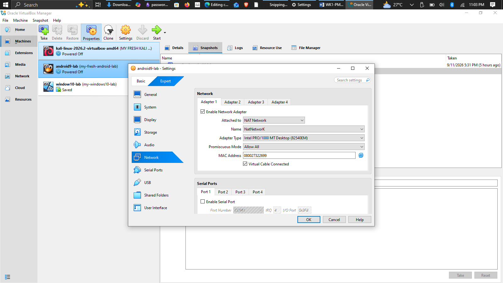

 ### 5. Static Network Configuration

The network interface was configured with static parameters using the Android graphical settings:

* **Connected SSID:** `Virt-Wifi`
* **IP Settings:** Static
* **IP Address:** `10.0.0.9`
* **Gateway:** `10.0.0.1`
* **Network Prefix Length:** `24`
* **DNS 1:** `8.8.8.8`
* **DNS 2:** `10.0.0.1`

#### Configuration Steps:
 Opened the app drawer and launched **Settings**.
   
 Navigated to **Network & Internet > Wi-Fi** and ensured Wi-Fi was toggled **ON**.
   
 Tapped on **Virt-Wifi** (or clicked the gear icon next to it and selected the pencil **Edit** icon).
   
 Expanded **Advanced options** and changed **IP settings** from *DHCP* to **Static**.
   
 Entered the static addressing parameters listed above and tapped **Save**.

> 

Engineering Note (CLI Alternative):

Prior to GUI confirmation, interface addressing was verified via the underlying Linux root shell (Alt + F1) by targeting the hypervisor's virtual network interface (wifi_eth):

ip addr flush dev wifi_eth

ip addr add 10.0.0.9/24 dev wifi_eth

ip link set dev wifi_eth up

ip route add default via 10.0.0.1 dev wifi_eth

### Android test connectivity
ping 8.8.8.8

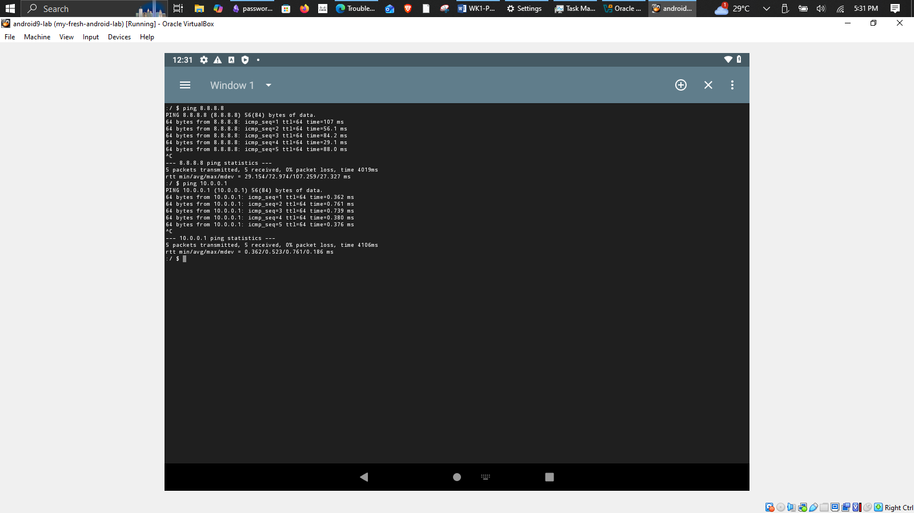 

### Test connectivity


android successfully pinged kali on 10.0.0.2

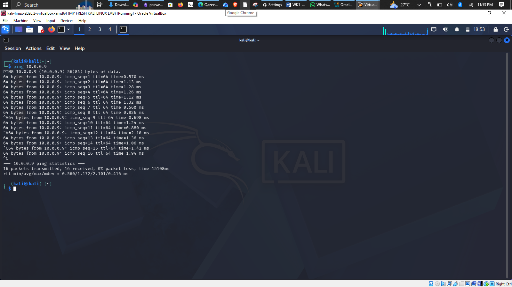
kali successfully pinged android on 10.0.0.9


### Here are only the 3 most important technical problems and their exact solutions:

1. Kali Linux: Network Timeout (DAD Fix)
Problem: Setting the static IP (10.0.0.2) caused network drops and delays on the VirtualBox NAT Network.  
PDF

Solution: Disabled duplicate address detection (DAD) timeout in the Kali terminal:  


Bash
sudo nmcli connection modify "Wired connection 1" ipv4.dad-timeout 0

sudo nmcli connection down "Wired connection 1"

sudo nmcli connection up "Wired connection 1"

2. Android-x86: Black Screen Display Freeze
   
Problem: Android-x86 hung on a black screen during boot and failed to load the desktop.  

Solution:

In VirtualBox VM settings, changed Graphics Controller to VBoxVGA and disabled 3D Acceleration.  


In the GRUB boot menu, added nomodeset xforcevesa to the kernel boot line.

3. Android-x86: "Device eth0 does not exist"
Problem: Running ip addr flush dev eth0 failed with the error that eth0 was not found.

Solution: Ran ip link show to detect the actual interface name (wifi_eth), then assigned the static IP directly to it:

Bash
ip addr flush dev wifi_eth

ip addr add 10.0.0.9/24 dev wifi_eth

ip link set dev wifi_eth up

ip route add default via 10.0.0.1 dev wifi_eth

** winodows10 ISO: https://www.microsoft.com/software-download/windows10 **
** Official Android-x86 Project Releases: https://www.android-x86.org/download.html


# 👤 Author

**Qazeem samshudeen**\
Cybersecurity enthusiast


LinkedIn: [https://www.linkedin.com/in/qazeem-samshudeen-94b314398/)

---

## 📌 Project Information

**Program Name:** Cybersecurity at Networkwalks | **Week:** 01 | **Project:** Cybersecurity & Pentesting Lab Setup | **Repository:** GitHub


